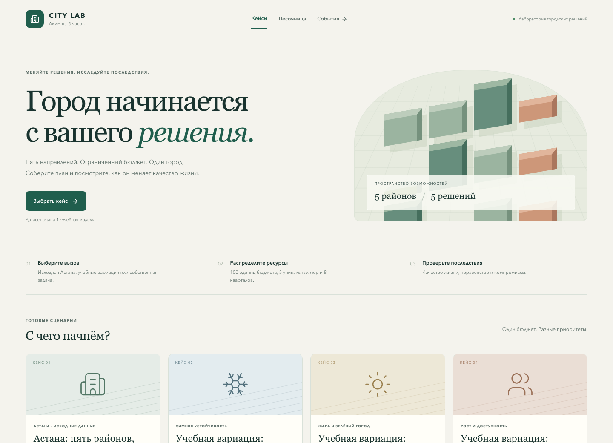
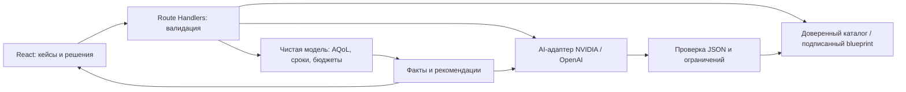

# Аким на 5 часов

AI-симулятор управления условным городом. За пять решений команда распределяет общий виртуальный бюджет между транспортом, зелёными зонами, социальной инфраструктурой, безопасностью и городскими сервисами.

Каждая команда начинает с одинаковых синтетических данных и бюджета. Система проверяет стоимость выбранных мероприятий, рассчитывает изменение показателей и формирует Astana Quality of Life Score (AQoL) с AI-объяснением сильных сторон, рисков и компромиссов.

Главная страница — City Lab: пять районов Астаны, десять показателей, 14 мер, ровно пять решений и бюджет 100. AI создаёт новые условия и объясняет последствия; численный результат считает серверная модель. Для честного сравнения команды выбирают один кейс и версию правил. Горизонт фиксирован: восемь кварталов.

| Режим | Что проверяет |
| --- | --- |
| `/` — City Lab | Исходный датасет Астаны и варианты зимы, жары, роста; лаги, синергии, критические показатели и рекомендации |
| `/sandbox` — базовый раунд | Пять решений при общем бюджете 100 и контрольных исходных данных |
| `/challenge` — городское событие | Исходный план, воздействие события и ответное перераспределение |



## Запуск

Требуется Node.js 22.x и pnpm 10.34.5. Версии зависимостей закреплены в package.json и lockfile.

```sh
corepack enable
pnpm install --frozen-lockfile
pnpm dev
```

Откройте `http://localhost:3000`.

Production-сборка:

```sh
pnpm build
pnpm start
```

Проверки модели, HTTP, AI-адаптеров и браузерного сценария:

```sh
pnpm test
pnpm lint
pnpm build
pnpm exec playwright install chromium
pnpm test:e2e
```

Браузерные тесты запускают production-сервер на порту 3210. Они используют подмену ответа AI и не расходуют ключи; реальный провайдер проверяется отдельно после настройки окружения.

## City Lab: экономика и AI-кейсы

Основной кейс `astana` точно воспроизводит предоставленную таблицу: Есиль, Алматы, Сарыарка, Байконур и Нура. Дополнительные `winter`, `heat`, `growth` — учебные вариации. Во всех случаях одинаковы каталог мер и правила: **100 единиц**, ровно **5 уникальных мер**, максимум **2 одного направления**. Районные меры требуют один район, городские действуют во всех пяти. Несовместимые сочетания отклоняются.

Реализованная доля каждого эффекта — `(8 − лаг) / 8`, включая отрицательные эффекты. Синергии фиксированы, лагом не масштабируются. После суммирования показатели ограничиваются диапазоном 0–100. Оценка района — взвешенная сумма десяти показателей. **Score = 0.7 × среднее с весами населения + 0.3 × слабейший район − число показателей строго ниже 40**.

| Контроль | Расход | Score | Критических показателей |
| --- | ---: | ---: | ---: |
| Исходные данные | — | 52.55768 | 2 |
| M7, M8, M10 в Нуре; M12 по городу; M5 в Сарыарке | 95 | 56.54307 | 0 |

Исходный Score — справочная точка, а не допустимый пустой план. Отчёт показывает районные изменения, вклад мер с учётом лага, синергии, штраф и до трёх улучшений. Рекомендации пересчитываются с полной валидацией. До 12 сохранений доступны в этом браузере: после перезагрузки можно открыть полный отчёт. При восстановлении сохранённого отчёта та же чистая модель локально перепроверяет данные; новый расчёт и AI-разбор проходят через сервер. Сравнение требует одинакового кейса и версии. Доступны JSON-экспорт, печать и необязательная процедурная 3D-схема с HTML-альтернативой.

AI создаёт только ограниченный blueprint: тему, описание и исходные районные показатели. Сервер проверяет структуру, восстанавливает доверенный каталог цен и подписывает кейс HMAC. Подпись действует семь дней; изменение данных клиентом отклоняется. В production для генерации нужен постоянный `CASE_SIGNING_SECRET` длиной минимум 32 символа. Без AI-ключа все готовые кейсы и расчёты доступны.

**Граница реализма:** названия районов реальные, но входные индексы и коэффициенты — предоставленные условия учебной модели, не подтверждённая статистика и не прогноз Астаны. Доля населения затронутых районов не равна числу доказанных благополучателей. [Методика](docs/model-assumptions.md), [полный датасет и правила](docs/design/astana-dataset.md), [контракт релиза](docs/design/release-city-lab.md).

## Архитектура



`src/domain` не зависит от React, HTTP и провайдеров. `src/data` задаёт версионированные правила, `src/application` связывает исходный сценарий с моделью. `src/infrastructure` содержит HTTP-схемы, подпись и AI-адаптеры; `src/app/api` — транспорт, `src/components` — интерфейс. Секреты не попадают в клиент, AI не может менять score, цены или бюджеты.

## Docker и Kubernetes

Production-образ использует Next.js standalone, работает от непривилегированного пользователя и слушает порт `3000`. Проверка готовности: `GET /api/health`. Ключ AI передаётся при запуске контейнера.

```sh
docker build -t akim-city:local .
docker run --rm --name akim -p 3000:3000 akim-city:local
```

В другом терминале выполните `pnpm smoke:deploy`: проверяются health, страница, статический файл и контрольный расчёт `/api/challenge`. Для AI добавьте `--env-file .env.local` перед именем образа.

Для локального Kubernetes с доступом к образу `akim-city:local`:

```sh
pnpm check:k8s
kubectl apply -k deploy/k8s
kubectl -n akim rollout status deployment/akim --timeout=180s
kubectl -n akim port-forward service/akim 3000:80
```

Проверка манифестов требует `kubectl`, Go 1.24+ и сеть для kubeconform и схем. Для удалённого кластера требуется загрузить образ в registry и указать его адрес. Контракт образа, Secret, настройка registry и остановка описаны в [`docs/runtime-contract.md`](docs/runtime-contract.md). CI проверяет схемы Kubernetes и запускает тот же smoke в собранном Docker-образе.

## API City Lab

| Endpoint | Назначение |
| --- | --- |
| `GET /api/cases` | Готовые кейсы и доступность генерации |
| `POST /api/cases/evaluate` | Проверка пяти решений и детерминированный отчёт |
| `POST /api/cases/analyze` | Повторный серверный расчёт и AI-объяснение |
| `POST /api/cases/generate` | Генерация условий, валидация, подписанный кейс |

Контрольный расчёт без ключа:

```sh
curl http://localhost:3000/api/cases/evaluate \
  -H 'Content-Type: application/json' \
  -d '{"caseId":"astana","decisions":[{"measureId":"M7","districtId":"nura"},{"measureId":"M8","districtId":"nura"},{"measureId":"M10","districtId":"nura"},{"measureId":"M12"},{"measureId":"M5","districtId":"saryarka"}]}'
```

Ожидаются `evaluation.result.spent=95`, `finalAqol=56.54307` (с погрешностью машинной арифметики), `criticalCount=0`. Для сгенерированного кейса добавляется `caseToken`, возвращённый генерацией. Клиентские цены, эффекты, score и лишние поля не принимаются. Невалидный набор возвращает причину и не получает score.

Генерация принимает `{"brief":"Описание условий нового кейса не короче 20 символов","theme":"winter"}`. Возможные темы: `baseline`, `winter`, `heat`, `growth`, `mobility`. Полный датасет, веса и правила — в [контракте astana-1](docs/design/astana-dataset.md). Дополнительные `/sandbox`, `/challenge` и их API описаны в [учебных режимах](docs/legacy-simulator.md); у них отдельная прежняя модель.

## AI-анализ

Скопируйте `.env.example` в `.env.local`. Для NVIDIA задайте `AI_PROVIDER=nvidia` и `NVIDIA_API_KEY`, для OpenAI — `AI_PROVIDER=openai` и `OPENAI_API_KEY`. Настройки моделей — `NVIDIA_MODEL` / `OPENAI_MODEL`. Ключ читается только сервером. В production также задайте `CASE_SIGNING_SECRET` (например, результат `openssl rand -hex 32`); один секрет должен использоваться всеми репликами.

Без ключа, при таймауте или ошибке провайдера система показывает недоступность AI, сохраняя детерминированный AQoL. AI-вызовы ограничены по частоте и параллелизму внутри процесса; для публичного многорепличного сервиса нужны общая квота и контроль доступа на входе. Базовый `/sandbox` использует исходный NVIDIA-адаптер.

## Статус

Проект реализуется спринтами. Спецификация находится в `docs/design/`, пошаговые планы — в `docs/superpowers/plans/`, параллельные дорожки команды — в [`docs/sprint-workstreams.md`](docs/sprint-workstreams.md).

Релиз City Lab проверен 23 сентября 2026: **99 unit/integration-тестов, 8 Chromium E2E, lint, production build, Docker и локальный Kubernetes**. Реальные генерация и анализ OpenAI прошли через браузер; NVIDIA проверен mock-тестами. [Протокол проверки](docs/release-verification.md), [демо на три минуты](docs/demo-script.md), [структура презентации](docs/presentation.md).

Иконки — [Lucide](https://lucide.dev/guide/react) (ISC), процедурная сцена — [Three.js](https://threejs.org/) (MIT). Внешние 3D-модели и изображения не загружаются; скриншот получен из работающего приложения.
